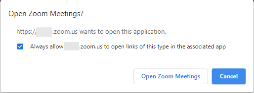
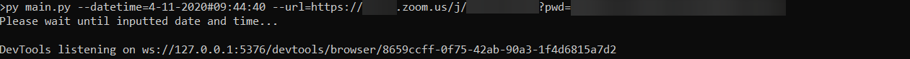

# Automatic Zoom Join
This is a python script to join a zoom meeting with inputted date & time from the arguments, created with selenium webdriver

Requirements for this script are (**taken at November 4<sup>th</sup> 2020**):
```
Python 3.6.8 or above
python-dotenv==0.14.0
requests==2.22.0
selenium==3.141.0
Chrome Webdriver 86.0.4240.22
```
Before running this script please make sure that:
---
1. Change .env.example to .env
2. Fill the **USER_DATA_DIR** variable with folder name of the chrome user data directory (also don't use **current directory** for the USER_DATA_DIR). Fill the **PROFILE_DIRECTORY** variable with folder name of the User Profile in the **USER_DATA_DIR** variable. You can check current chrome user profile directory by accessing [chrome:://version](chrome:://version).
3. Please take consideration that you need to create a new chrome user or use the existing one that has **Always allow \*.zoom.us to open links of this type in the associated app** already checked

4. Copy the chrome user profile into chrome user data directory in the local environment. For example
    <pre>
    .
    +-- <b>USER_DATA_DIR</b>
    |   ...
    |   +-- <b>PROFILE_DIRECTORY</b>
    |   ...
    +-- main.py
    +-- .env
    +-- README.md
    </pre>


This script takes 2 arguments to work
* -d or --datetime
* -u or --url

Usage
---
The -d argument takes date and time with specific format
```
Format: [day of month]-[month]-[full year]#[hours]:[minutes]:[seconds]
```
The -u argument takes a valid zoom url

```
python3 main.py -d 4-11-2020#23:59:59 -u https://zoom.us
```
Screenshots
---


Next target (i think)
---
Support for:

* Firefox
* Microsoft Edge (Chromium base)